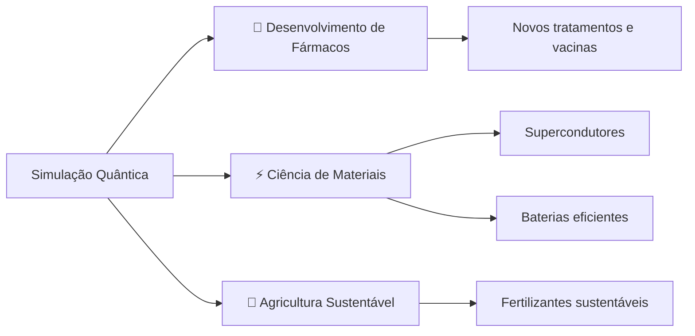

<div align="center">

# Quantum Algorithms

### _Explorando o Futuro da Computação Quântica_

</div>

Uma plataforma interativa e moderna para explorar os principais **algoritmos quânticos** que estão moldando o futuro da tecnologia. Aqui, você encontrará explicações claras, exemplos práticos e aplicações reais dos algoritmos mais revolucionários da computação quântica.

---

## 📚 Algoritmos Implementados

### Introdução: O que são Algoritmos Quânticos?

> 💡 **Conceito Fundamental**

Algoritmos quânticos são projetados para rodar em **computadores quânticos**, aproveitando os princípios da mecânica quântica para resolver problemas que são intratáveis para os computadores clássicos. 

**Conceitos-chave:**
- 🔮 **Qubits**: Diferentemente dos bits (0 ou 1), podem existir em múltiplos estados simultaneamente
- ⚡ **Superposição**: Capacidade de explorar múltiplas soluções ao mesmo tempo
- 🔗 **Emaranhamento**: Interligação complexa entre qubits que confere poder computacional revolucionário

<br>

### Algoritmo de Shor: O Quebrador de Criptografia 🔐

O Algoritmo de Shor é talvez o mais famoso, pois demonstra uma **vantagem quântica exponencial** sobre os melhores algoritmos clássicos.

#### 🎯 Função Principal
Fatorar números inteiros muito grandes em seus fatores primos (ex: `15 → 3 × 5`)

#### 💥 Impacto e Aplicações Práticas

| Área | Impacto |
|------|---------|
| 🛡️ **Criptografia RSA** | Um supercomputador levaria bilhões de anos para quebrar uma chave RSA moderna. O Algoritmo de Shor poderia fazer isso em **horas ou dias** |
| 🔒 **Segurança Web** | A segurança de transações bancárias, senhas e e-mails está em risco |
| 🆕 **Criptografia Pós-Quântica** | Impulsionou a criação de novos métodos de criptografia seguros contra ataques quânticos |

<br>

### Algoritmo de Grover: A Super-Busca 🔍

Este algoritmo oferece uma **aceleração quadrática** para buscas em bancos de dados não estruturados.

#### 🎯 Função Principal
Encontrar um item específico em uma lista de `N` itens em aproximadamente `√N` passos

```
Algoritmo Clássico: N/2 passos (média)
Algoritmo de Grover: √N passos
```

#### 🚀 Aplicações Práticas

- **🗺️ Otimização de Rotas**: Problema do Caixeiro Viajante - encontrar a rota mais eficiente entre várias cidades
- **🤖 Inteligência Artificial**: Acelera buscas em grandes espaços de estados para otimizar parâmetros em ML
- **🔌 Verificação de Circuitos**: Encontra falhas em designs de chips eletrônicos de forma mais rápida

<br>

### Simulação Quântica: Imitando a Natureza 🧬

Uma das aplicações **mais promissoras** e de curto prazo da computação quântica!

#### 🎯 Função Principal
Modelar o comportamento de moléculas e materiais em nível atômico com **altíssima precisão**

#### 🌟 Aplicações Revolucionárias



**Exemplos Concretos:**
- 💊 **Medicina**: Simular interação de medicamentos com proteínas do corpo humano
- 🔋 **Energia**: Projetar baterias mais eficientes para carros elétricos
- ❄️ **Materiais**: Criar supercondutores que funcionem em temperatura ambiente
- 🌾 **Agricultura**: Processo de fixação de nitrogênio com menor consumo de energia

<br>

### Algoritmos Híbridos (Era NISQ) 🔄

Na era atual de **"Computadores Quânticos Ruidosos de Escala Intermediária"** (NISQ), algoritmos híbridos que combinam processadores quânticos e clássicos são fundamentais.

#### 🧪 VQE (Variational Quantum Eigensolver)

| Característica | Descrição |
|----------------|-----------|
| 🎯 **Função** | Encontra a energia mínima de uma molécula (estado fundamental) |
| 🏭 **Uso Real** | Empresas como a **Dow** calculam propriedades de novas moléculas |
| 💡 **Aplicação** | Design de produtos químicos mais eficientes |

#### 📊 QAOA (Quantum Approximate Optimization Algorithm)

| Característica | Descrição |
|----------------|-----------|
| 🎯 **Função** | Encontra soluções aproximadas para problemas de otimização complexos |
| 💰 **Finanças** | Otimização de portfólios para maximizar retornos |
| 🚗 **Logística** | **Volkswagen** usa para otimizar fluxo de tráfego |

<br>

## 👥 Colaboradores

<a href="https://github.com/PedroFnseca/quantum-algorithms/graphs/contributors">
  
</a>
